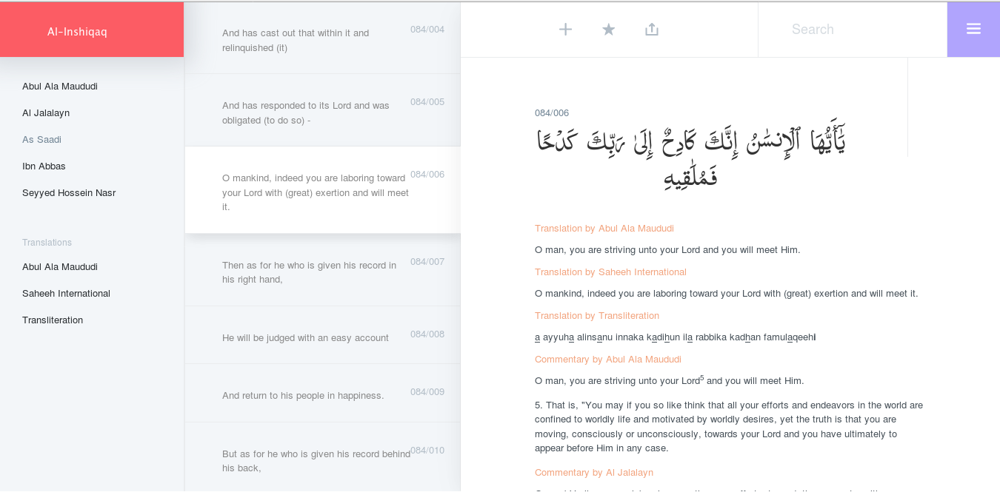

Nuun is intended as an interface to read and study various commentaries of Qur'anic verses. 

### Major Features

* User can select any number of commentaries and translations from the available list to view at a time. 
* User can add notes and bookmark various verses
* User can add their own commentaries and translations for single/multiple verses.